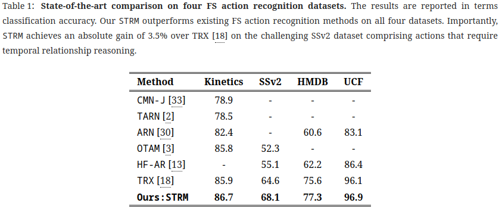

# Spatio-temporal Relation Modeling for Few-shot Action Recognition (CVPR 2022)

[[`Paper`](https://arxiv.org/pdf/2112.05132.pdf)][[`Project Page`](https://anirudh257.github.io/strm/)]

#### [Anirudh Thatipelli](https://scholar.google.com/citations?user=WVj4bQYAAAAJ&hl=en), [Sanath Narayan](https://sites.google.com/view/sanath-narayan), [Salman Khan](https://salman-h-khan.github.io/), [Rao Muhammad Anwer](https://scholar.google.fi/citations?hl=en&user=_KlvMVoAAAAJ&view_op=list_works&sortby=pubdate), [Fahad Shahbaz Khan](https://sites.google.com/view/fahadkhans/home), [Bernard Ghanem](https://www.bernardghanem.com/) ####

## Installation
The codebase is built on PyTorch 1.9.0 and tested on Ubuntu 18.04 environment (Python3.8.8, CUDA11.0) and trained on 4 GPUs. Build  a conda environment using the requirements given in [environment.yaml](environment.yaml).

## Attention Visualization

## Results

| **Method**    | **Kinetics**  | **SSv2** | **HMDB** | **UCF** |
| ------------- | --------------| ---------|----------|---------|
| CMN-J         | 78.9          |   -      |   -      |   -     |
| TARN          | 78.5          |   -      |   -      |   -     |
| ARN           | 82.4          |   -      | 60.6     |83.1     |
| OTAM          | 85.8          | 52.3     | -        | -       |
|HF-AR          |   -           | 55.1     | 62.2     | 86.4    |
|TRX            |  85.9         | 64.6     | 75.6     | 96.1    |
| **STRM [Ours]**|  **86.7**     | **68.1** | **77.3** | **96.8**|

<!-- <table>
  <tr>
       
  </tr>
</table> -->

## Training and Evaluation

## Step 1 : Data preparation

Prepare the datasets according to the [splits](splits) provided.

## Step 2 : Training 

Use the scripts given in [scripts](scripts)

## Step 3 : Evaluation

1) Use the evaluation script as given in [eval_strm_ssv2.sh](scripts/eval_strm_ssv2.sh)

2) Download the checkpoints from these links: [SSV2](https://drive.google.com/drive/folders/10OWh4GPBbX1-qr4s8d0rnMqGbn92Pqux), [Kinetics](https://drive.google.com/file/d/1OUCNae0BI2DRefeiU_m232q5OKzE7BIy/view?usp=sharing), [HMDB](https://drive.google.com/file/d/1bDoeJBFYSn5gNWF3oarevvCeqOSyeSnB/view?usp=sharing), [UCF](https://drive.google.com/file/d/10AAZuEIhJ_no5qNn7DCU7XlsABUo6uc-/view?usp=sharing)
     

## Citation
If you find this repository useful, please consider giving a star :star: and citation :confetti_ball::

    @inproceedings{thatipelli2021spatio,
      title={Spatio-temporal Relation Modeling for Few-shot Action Recognition},
      author={Thatipelli, Anirudh and Narayan, Sanath and Khan, Salman and Anwer, Rao Muhammad and Khan, Fahad Shahbaz and Ghanem, Bernard},
      booktitle={CVPR},
      year={2022}
    }

## Acknowledgements

The codebase was built on top of [trx](https://github.com/tobyperrett/trx). Many thanks to [Toby Perrett](https://tobyperrett.github.io/) for previous work.

## Contact
Should you have any question, please contact :e-mail: thatipellianirudh@gmail.com or message me on [Linkedin](https://www.linkedin.com/in/anirudh-thatipelli-85a650111/).
